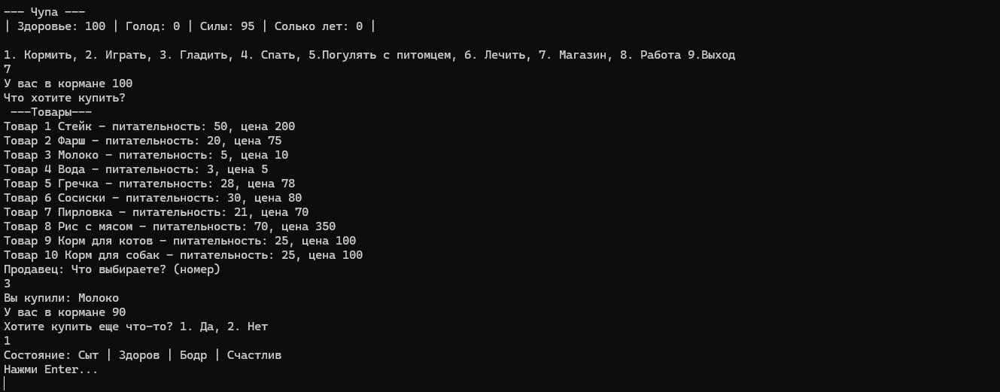

# Console Tamagotchi




**Console Tamagotchi** is a robust simulation game developed to practice **Object-Oriented Programming (OOP)**, **Memory Management**, and **Clean Architecture** principles in C#.

It simulates the life cycle of a pet with complex internal states, an economic system, inventory management, and diverse interactions.

---

## Key Features (Engineering Focus)

### Architecture & Design
- **Layered Structure:** strict separation of concerns between `Domain` (Entities), `Logic` (Game Services), and `UI` (Console I/O).
- **Deep OOP Implementation:**
  - **Inheritance:** Abstract base class `Pet` extended by concrete `Dog` and `Cat` classes.
  - **Polymorphism:** `virtual` and `override` methods for unique pet behaviors (`Feed`, `Play`, `MakeSound`).
  - **Encapsulation:** All fields are `private`; state is modified only through public methods with validation logic.

### Gameplay Mechanics
- **Resource Management:** Implementation of an Inventory system using `List<Food>` and dynamic item tracking.
- **Economy System:** Working logic for earning money (`Work` mechanic) and spending it in a `Shop` service.
- **Dynamic State:** The pet's stats (Hunger, Health, Stamina) change in real-time based on user actions and the "Wait" mechanic.
- **Input Validation:** Robust handling of user input using `Enum.TryParse` to prevent crashes.

### Tech Stack
Language: C# 12
Framework: .NET 9.0
IDE: Visual Studio 2022
Concepts: List<T>, Enums, Control Flow, Constructors, Properties.

### How to Run
Clone the repository:
code
Bash
git clone https://github.com/Rizruf/Console-Tamagotchi.git
Open the solution file ConsoleTamagotchi.sln.
Build and Run (F5).
---

## Project Structure

```text
ConsoleTamagotchi/
├── Domain/           # Core Entities & Value Objects
│   ├── Pet.cs        # Abstract Base Class (Logic & State)
│   ├── Dog.cs        # Concrete Implementation
│   ├── Cat.cs        # Concrete Implementation
│   └── Food.cs       # Data Class for items
├── Logic/            # Game Services
│   └── Shop.cs       # Shop logic and item generation
└── Program.cs        # Entry Point, Game Loop & UI
